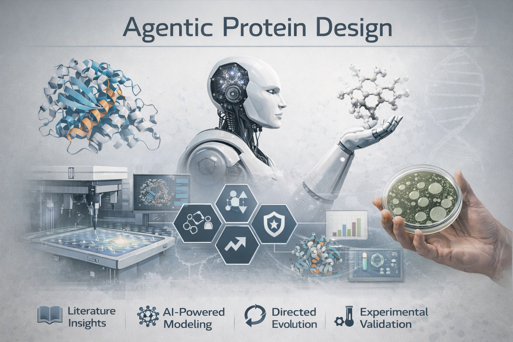

# Agentic Protein Design

A notebook-first, local-first workflow for **early-stage enzyme engineering** focused on **enzyme candidate analysis** and **initial selection of engineering targets**.

## Project Scope

This project is designed to support the discovery and analysis phase of protein engineering by combining:
- literature and database retrieval
- homolog and structure context
- pocket/alignment feature analysis
- LLM-based interpretation for human-readable, engineering-relevant insights

See full architecture and roadmap in [Plans.md](Plans.md).

## Current Workflow Architecture

- **Primary UI (current)**: Jupyter notebooks in [`notebooks/`](notebooks)
- **Reusable package layer**: importable step/workflow modules in [`src/agentic_protein_design/`](src/agentic_protein_design)
- **Legacy helper modules**: removed; import directly from [`src/agentic_protein_design/`](src/agentic_protein_design)
- **Config-driven data roots**: via `address_dict` and `subfolders` in [`project_config/variables.py`](project_config/variables.py)
- **Local chat memory**: per-thread JSON files under `chats/` (git-ignored)
- **Outputs**: written to each selected data root's standard subfolders (especially `processed/`)

## Available Notebooks (more to come)

- [`notebooks/01_literature_review.ipynb`](notebooks/01_literature_review.ipynb)  
  Retrieval-backed literature survey and protein database scan, followed by LLM-generated, engineering-focused synthesis.  
  Includes source diagnostics, quality scoring/downweighting, and compact thread-memory persistence.

- [`notebooks/02_binding_pocket_analysis.ipynb`](notebooks/02_binding_pocket_analysis.ipynb)  
  Binding-pocket comparative analysis from pocket descriptors + filtered alignment (+ optional reaction data), with LLM-generated mechanistic interpretation and compact thread-memory persistence.

## Programmatic Reuse (for larger workflows)

In addition to notebook cells, you can now import step/workflow functions from:
- [`src/agentic_protein_design/steps/literature_review.py`](src/agentic_protein_design/steps/literature_review.py)
- [`src/agentic_protein_design/steps/binding_pocket.py`](src/agentic_protein_design/steps/binding_pocket.py)
- [`src/agentic_protein_design/workflows/multistep.py`](src/agentic_protein_design/workflows/multistep.py)

This enables a "master notebook" to run individual steps or a composed multi-step workflow with shared inputs.

## Environment Setup

You can run with either conda or pip:

- Conda:
  - `conda env create -f environment.yml`
  - `conda activate agentic-protein-design`

- Pip:
  - `python -m venv .venv`
  - `source .venv/bin/activate`
  - `pip install -r requirements.txt`

## API Keys

For notebook LLM calls, set your key in [`project_config/local_api_keys.py`](project_config/local_api_keys.py).  
This file is git-ignored.

## Notes

- Place the provided landing image at `assets/landing-page.png` so it renders on GitHub.
- Generated outputs in `processed/` and chat history in `chats/` are excluded from version control.
